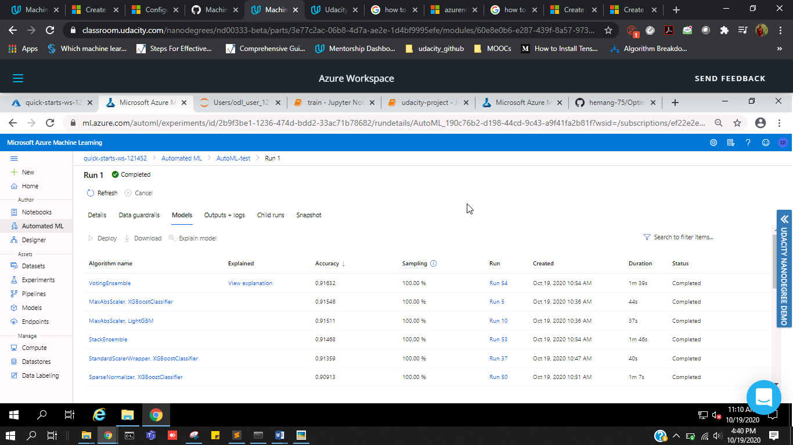
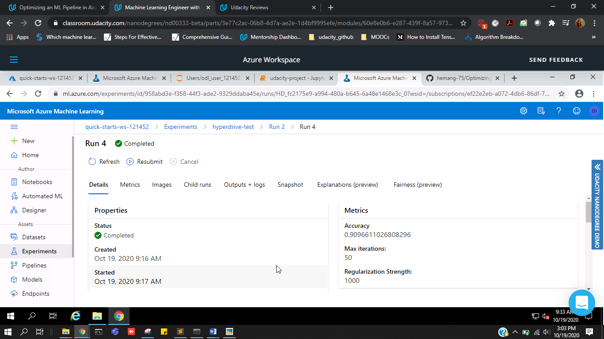
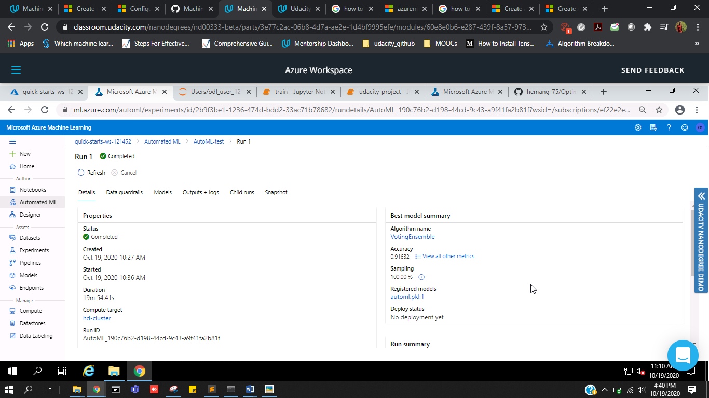
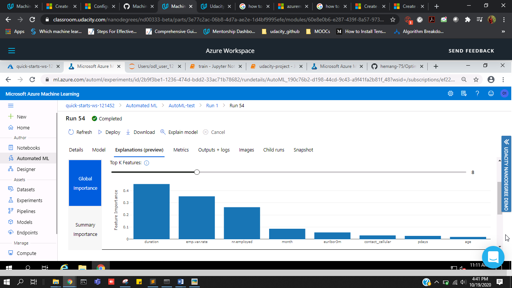

# Optimizing an ML Pipeline in Azure

## Overview
This project is part of the Udacity Azure ML Nanodegree its the first project in this nano degree program.

In this project, we manufacture and advance an Azure ML pipeline utilizing the Python SDK and a gave Scikit-learn model. 

The hyper-boundaries of the Scikit-learn model will be tuned utilizing Azure HyperDrive functionality.This model is then contrasted with an Azure AutoML run

## Summary

- In this problem the dataset contains data about the financial and personal details of the customers of a Portugese bank. We seek to predict if the customer will subscribe to bank term deposit or not. <br>
- First , a Scikit-learn based LogisticRegression model is defined and used and the hyperparameters of the model are tuned using Azure HyperDrive functionality. <br>
- Then, the same dataset is provided to Azure AutoML to try and find the best model using its functionality. <br>
- Out of all the models, the best performing model was a Soft Voting Ensemble found using AutoML. It uses XGBoost Classifier with a standard scaler wrapper.

## Scikit-learn Pipeline

### Pipeline Architecture
- In the Pipeline, first the dataset is retrieved from the given url using AzureDataFactory class. <br>
- Then the data is cleaned using clean_data method in which some preprocessing steps were performed like converting categorical variable to binary encoding, one hot encoding,etc and then the dataset is split in ratio of 70:30 (train/test) for training and testing and sklearn's LogisticRegression Class is used to define Logistic Regression model. <br>
- A SKLearn estimator which is used for training in Scikit-learn experiments is used here and it takes training scripts and performs the training on the compute. This estimator will later be passed to the HyperDrive Config script.
- Then a HyperDrive Config is created using the estimator, parameter sampler and a policy and the HyperDrive run is executed in the experiment.
- The hyperparameters which are needed to be tuned are defined in the parameter sampler. The hyperparameters that can be tuned here are C and max_iter. C is the inverse regularization parameter and max_iter is the maximum number of iterations. <br>
- The train.py script contains all the steps needed to train and test the model which are data retrieval, data cleaning and pre-processing, data splitting into train and test data, defining the scikit-learn model and training the model on train data and predicting it on the test data to get the accuracy and then saving the model. <br>
- Finally ,the best run of the hyperdrive is noted and the best model in the best run is saved. <br>

### Benefits of parameter sampler
- The parameter sampler is used to provide different choices of hyperparameters to choose from and try during hyperparameter tuning using hyperdrive. <br>
- I have used Random Parameter Sampling in the parameter sampler so that it can be used to provide random sampling over a hyperparameter search space.
- For our problem statement, the hyperparameters provided in the hyperparamete search space are C and max_iter.The different choices for the values of C and max_iter are provided so that the hyperdrive can try all the combinations of choices to do the hyperparameter tuning in order to get the best model with the maximum accuracy.

### Benefits of Early Stopping policy
- One can define an Early Stopping policy in HyperDriveConfig and it is useful in stopping the HyperDrive run if the accuracy of the model is not improving from the best accuracy by a certain defined amount after every given number of iterations <br>
- In this model,we have defined a Bandit Policy for early stopping with the parameters slack_factor and evaluation_interval which are defined as :
  - slack_factor :  The amount of slack allowed with respect to the best performing training run. This factor specifies the slack as a ratio. <br>
  - evaluation_interval : The frequency for applying the policy. Each time the training script logs the primary metric counts as one interval.<br>
- The main benefit of using early stopping is it saves a lot of computational resources

## AutoML
- AutoML means Automated ML which means it can automate all the process involved in a Machine Learning process. For example, we can automate feature engineering, hyperparameter selection, model training, and tuning and can train and deploy 100 models in a day all with the help of AutoML.
- When i applied AutoML to our problem, it did a great task and i was surprised to see that AutoML tried so many different models in such a short time some of which i couldn't even think of trying or implementing. The models tried by AutoML were RandomForests,BoostedTrees,XGBoost,LightGBM,SGDClassifier,VotingEnsemble, etc. AutoML used many different input preprocessing normalization like Standard Scaling, Min Max Scaling, Sparse Normalizer, MaxAbsScaler, etc. It has also handled class imbalance very well by itself. <br>
- To run AutoML, one needs to use AutoMLConfig class just like HyperdriveConfig class and need to define an automl_config object and setting various parameters in it which are needed to run the AutoML. Some of these parameters are : <br>
    - task : what task needs to be performed , regression or classification <br>
    - training_data : the data on which we need to train the autoML. <br>
    - label_column_name : the column name in the training data which is the output label. <br>
    - iterations : the number of iterations we want to run AutoML. <br>
    - primary_metric : the evaluation metric for the models <br>
    - n_cross_validations : n-fold cross validations needed to perform in each model <br>
    - experiment_timeout_minutes : the time in minutes after which autoML will stop. <br>
- Here is the list of all the models tested during AutoML run :



## Pipeline comparison

- Overall,the difference in accuracy between the AutoML model and the Hyperdrive tuned custom model is not too much. AutoML accuracy was 0.9163 while the Hyperdrive accuracy was 0.9096

- With Respect to architecture AutoML was better than hyperdrive because it tried a lot of different models, which was quite impossible to do with Hyperdrive because for that we have to create pipeline for every model.

- There was not much difference in accuracy maybe because of the data set but AutoML really tried and computed some very complex models to get the best result and model out of the given dataset.

The best run/model of HyperDrive : 



The best run/model in AutoML :



Some of the top features in our dataset as learnt by the best AutoML model are :



## Future work

- One thing which i would want in future as further improvement will be to able to give different custom cross validation strategy to the AutoML model. 
- I have tried running AutoML with both clean and preprocessed dataset and also raw and uncleaned dataset to see whether it can do the cleaning and pre-processing by itself and it gave good results in both of them so i dont know how AutoML handled it itself and it saved my trouble of data cleaning. So i want to know whether it can do this data cleaning for all types of ML problems or not.

## Proof of cluster clean up

- Here is the snapshot of deleting the compute cluster i took when the cluster was getting deleted


```python

```
